# 서비스 시나리오

기능적 요구사항
1. 고객이 운전형태(자동/수동)을 선택하고 대리기사 호출 요청한다.
2. 고객호출 위치에서 가용 가능한 대리기사를 할당 요청한다.
3. 할당요청된 대리기사중 하나를 자동할당 한다.
4. 할당 즉시, 고객에게 기사배정완료 정보를 전달 한다.
5. 고객은 대리기사호출을 취소 할 수 있다.
6. 호출이 취소 되면 해당 배정을 취소한다.
7. 고객은 기사배정상태를 중간중간 조회하고 카톡으로 받는다.

비기능적 요구사항
1. 트랜잭션
- 대리기사가 할당확인 되지 않으면 고객 대리기사배정요청을 할 수 없다. Sync 호출
2. 장애격리
- 대리기사 할당요청은 할당확인 기능이 동작하지 않더라도, 365일 24시간 받을 수 있어야 한다 Async (event-driven), Eventual Consistency
- 대리기사요청이 과중되면 대리기사 할당확인 요청을 잠시동안 받지 않고 잠시후에 하도록 유도한다 Circuit breaker, fallback
3. 성능
- 고객은 대리기사 상태를 조회하고 할당/할당취소 여부를 카톡으로 확인 할 수 있어야 한다. CQRS, Event driven


# 체크포인트

1. Saga
1. CQRS
1. Correlation
1. Req/Resp
1. Gateway
1. Deploy/ Pipeline
1. Circuit Breaker
1. Autoscale (HPA)
1. Zero-downtime deploy (Readiness Probe)
1. Config Map/ Persistence Volume
1. Polyglot
1. Self-healing (Liveness Probe)


# 분석/설계


## Event Storming 결과
* MSAEz 로 모델링한 이벤트스토밍 결과: 


### 이벤트 도출


### 부적격 이벤트 탈락


- 과정중 도출된 잘못된 도메인 이벤트들을 걸러내는 작업을 수행함
- 대리기사 등급 선택됨,  :  UI 의 이벤트이지, 업무적인 의미의 이벤트가 아니라서 제외
- 가용 대리기사 조회됨 :  계획된 사업 범위 및 프로젝트에서 벗어서난다고 판단하여 제외


	

### 액터, 커맨드 부착하여 읽기 좋게


### 어그리게잇으로 묶기


   - 호출, 대리기사관리, 대리기사 할당 어그리게잇을 생성하고 그와 연결된 command 와 event 들에 의하여 트랜잭션이 유지되어야 하는 단위로 그들 끼리 묶어줌 
 


### 바운디드 컨텍스트로 묶기


### 폴리시 부착 (괄호는 수행주체, 폴리시 부착을 둘째단계에서 해놔도 상관 없음. 전체 연계가 초기에 드러남)


### 폴리시의 이동


### 컨텍스트 매핑 (점선은 Pub/Sub, 실선은 Req/Resp)


### 완성된 모형


### 기능적 요구사항 검증


고객이 대리기사를 호출요청한다.(ok)
대리기사 관리 시스템이 대리기사 할당을 요청한다.(ok)
대리기사 자동 할당이 완료된다.(ok)
호출상태 및 할당상태를 갱신한다.(ok)
고객에게 카톡 알림을 한다.(ok)


고객이 대리기사를 호출취소요청한다.(ok)
대리기사 관리 시스템이 대리기사 할당 취소를 요청한다.(ok)
대리기사 할당이 취소된다.(ok)
취소상태로 갱신한다.(ok)
고객에게 카톡 알림을 한다.(ok)


  
	- 고객이 호출진행내역을 볼 수 있어야 한다. (ok)


### 비기능 요구사항 검증


- 마이크로 서비스를 넘나드는 시나리오에 대한 트랜잭션 처리 
- 대리기사 할당요청이 완료되지 않은 호출요청 완료처리는 최종 할당이 되지 않는 경우 
  무한정 대기 등 고객 서비스 및 신뢰도에 치명적 문제점이 있어 ACID 트랜잭션 적용. 
  호출요청 시 대리기사 할당요청에 대해서는 Request-Response 방식 처리 
- 호출요청 완료시 할당확인 및 결과 전송: driver manage service 에서
  driver Assign 마이크로서비스로 수리기사할당 요청이 전달되는 과정에 있어서 
  driver Assign 마이크로 서비스가 별도의 배포주기를 가지기 때문에 Eventual Consistency 방식으로 트랜잭션 처리함. 
- 나머지 모든 inter-microservice 트랜잭션: 호출상태, 할당/할당취소 여부 등 이벤트에 대해 카톡을 처리하는 등, 
  데이터 일관성의 시점이 크리티컬하지 않은 모든 경우가 대부분이라 판단, Eventual Consistency 를 기본으로 채택함


## 헥사고날 아키텍처 다이어그램 도출 (Polyglot)


# 구현:

서비스를 로컬에서 실행하는 방법은 아래와 같이 
각 서비스별로 bat 파일형태로 실행합니다. 

```
- run_drivercall.bat
cd ..\drivercenter\drivercall
mvn clean spring-boot:run
pause ..

- run_dirvermanage.bat
call setenv.bat
cd ..\drivercenter\drivermanage
mvn clean spring-boot:run
pause ..

- run_driverassign.bat
call setenv.bat
cd ..\drivercenter\driverassign
mvn clean spring-boot:run
pause ..

- run_customer.bat
call setenv.bat
SET CONDA_PATH=%ANACONDA_HOME%;%ANACONDA_HOME%\BIN;%ANACONDA_HOME%\condabin;%ANACONDA_HOME%\Library\bin;%ANACONDA_HOME%\Scripts;
SET PATH=%CONDA_PATH%;%PATH%;
cd ..\taxiguider_py\customer\
python policy-handler-local.py 
pause ..

```

## DDD 의 적용
총 3개의 Domain 으로 관리되고 있으며, drivercall(대리기사요청) , drivermanage(대리기사관리), driverassign(대리기사할당) 으로 구성됩니다. 

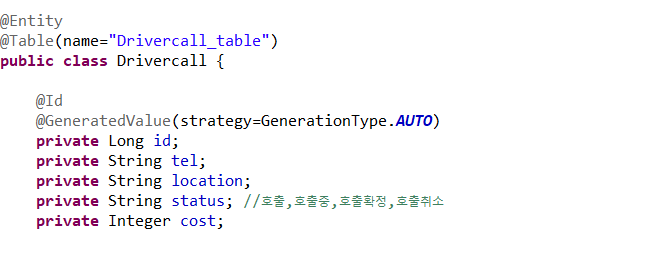

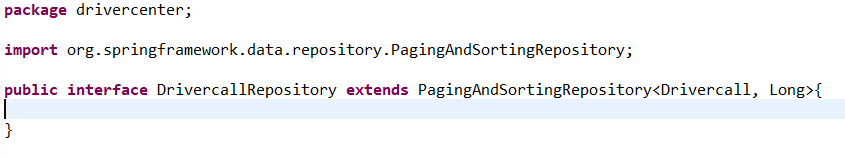

## 폴리글랏 퍼시스턴스

```
위치 : /drivercenter>drivermanage>pom.xml
```
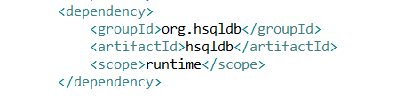


## 폴리글랏 프로그래밍 - 파이썬
```
로컬용 위치 : /drivercenter>cutomer>policy-handler-local.py
클라우드용 위치 : /drivercenter>cutomer>policy-handler.py
```
로컬용

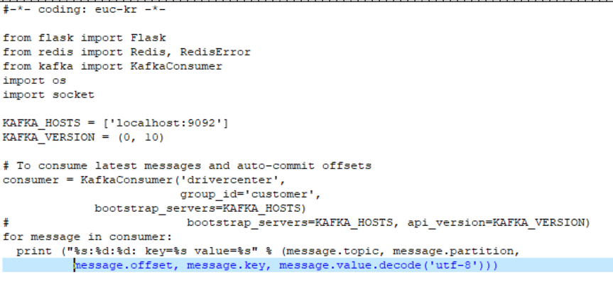
클라우드용

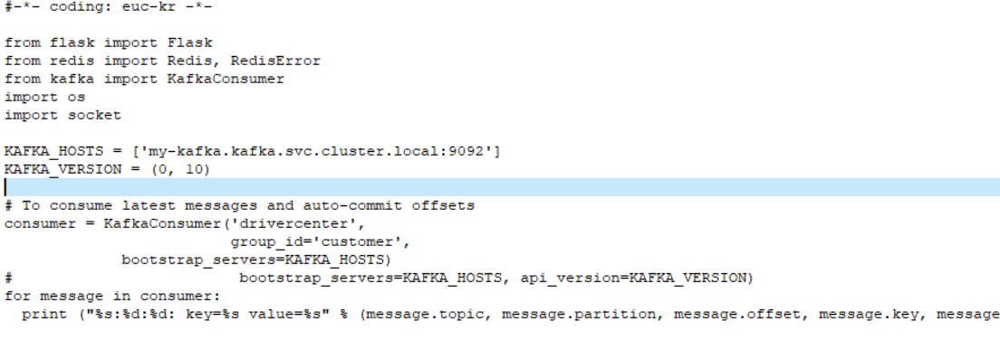

## 마이크로 서비스 호출 흐름

- drivercall 서비스 호출처리
대리기사호출(drivercall)->대리기사관리(drivermanage) 간의 호출처리 됨.
대리기사할당 서비스에서 대리기사를 할당하면 대리기사 호출에서는 호출 확정 상태가 됨.
서비스를 확인 하기 위해서 다음과 같이 두 개의 호출 상태를 만듬.
```
http localhost:8081/drivercalls tel="01012345678" status=호출 location="마포" cost=25000
http localhost:8081/drivercalls tel="01056789012" status=호출 location="서대문구" cost=30000
```


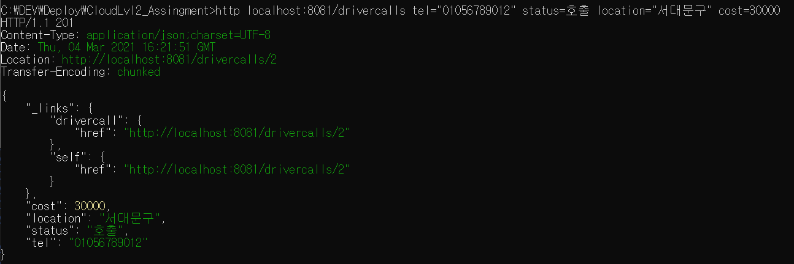

호출 결과는 모두 택시 할당(taxiassign)에서 택시기사의 할당으로 처리되어 호출 확정 상태가 되어 있음.

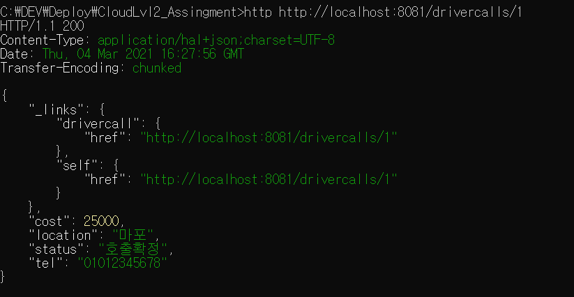
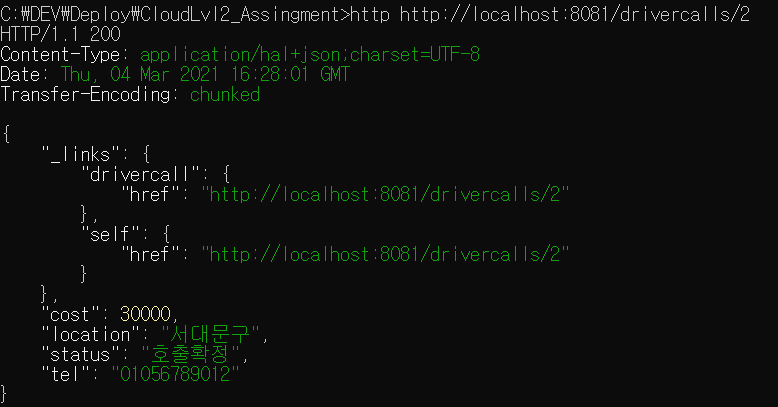
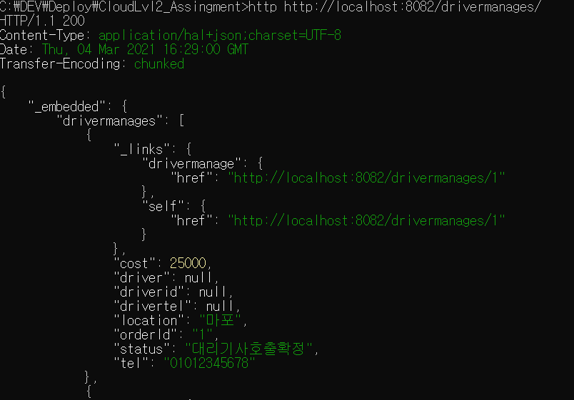


- drivercall 서비스 호출 취소 처리

대리기사호출 취소는 대리기사호출에서 다음과 같이 호출 하나를 취소 함으로써 진행 할 수 있음.

```
http delete http://localhost:8081/drivercalls/1
HTTP/1.1 204
Date: Tue, 02 Mar 2021 16:59:12 GMT
```
호출이 취소 되면 대리기사 호출이 하나가 삭제 되었고, 

```
http localhost:8081/drivercalls/
```
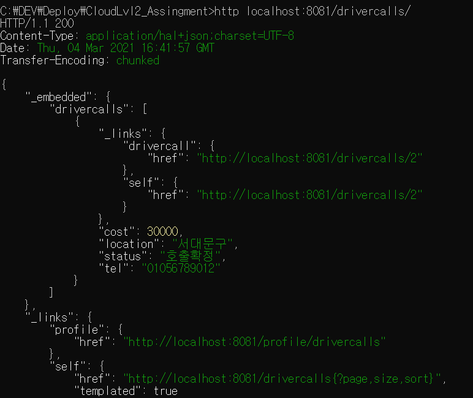


대리기사관리에서는 해당 호출에 대해서 대리기사호출취소로 상태가 변경 됨.

```
http localhost:8082/drivermanages/
```


- 고객 메시지 서비스 처리
고객(customer)는 대리기사 호출 확정과 할당 확정에 대한 메시지를 다음과 같이 받을 수 있으며,
할당 된 대리기사의 정보를 또한 확인 할 수 있습니다(파이썬 구현).

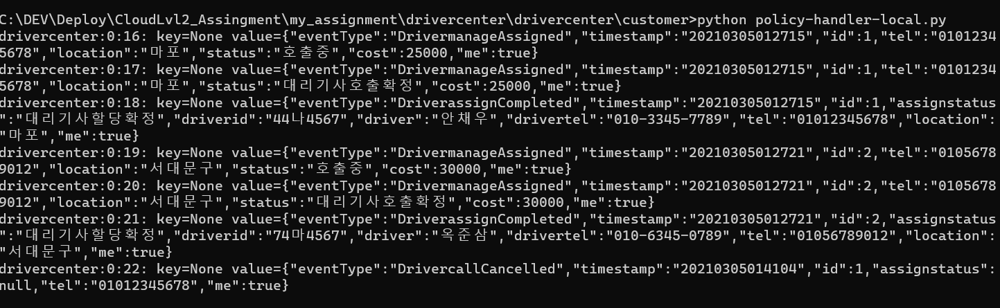


## Gateway 적용

서비스에 대한 하나의 접점을 만들기 위한 게이트웨이의 설정은 8088로 설정 하였으며, 다음 마이크로서비스에 대한 설정 입니다.
```
대리기사호출 서비스 : 8081
대리기사관리 서비스 : 8082
대리기사할당 서비스 : 8083
```

gateway > applitcation.yml 설정

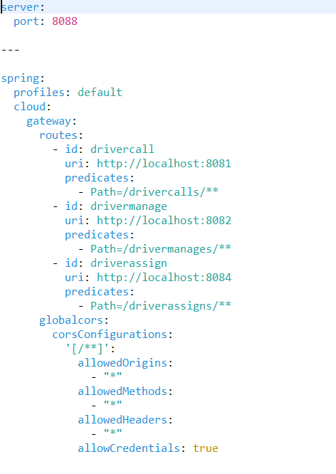


gateway 테스트

```
http localhost:8088/drivercalls
-> gateway 를 호출하나 8081 로 호출됨
```
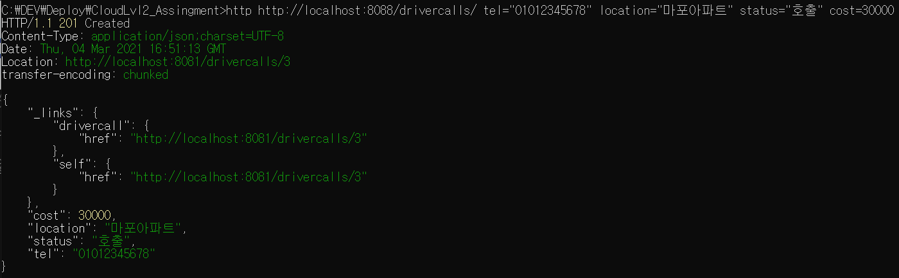


## 동기식 호출 과 Fallback 처리

호출(drivercall)->택시관리(drivermanage) 간의 호출은 동기식 일관성을 유지하는 트랜잭션으로 처리함.
호출 프로토콜은 이미 앞서 Rest Repository 에 의해 노출되어있는 REST 서비스를 FeignClient 를 이용하여 호출하도록 한다. 


```
# external > DrivermanageService.java

package drivercenter.external;

import org.springframework.cloud.openfeign.FeignClient;
import org.springframework.web.bind.annotation.RequestBody;
import org.springframework.web.bind.annotation.RequestMapping;
import org.springframework.web.bind.annotation.RequestMethod;

@FeignClient(name="drivermanage", url="http://localhost:8082", fallback = DrivermanageServiceFallback.class)
//@FeignClient(name="drivermanage", url="http://drivermanage:8080", fallback = DrivermanageServiceFallback.class)
public interface DrivermanageService {

    @RequestMapping(method= RequestMethod.POST, path="/drivermanages")
    public void reqDriverassign(@RequestBody Drivermanage drivermanage);

}

```

```
# external > DrivermanageServiceFallback.java


package drivercenter.external;

import org.springframework.stereotype.Component;

@Component
public class DrivermanageServiceFallback implements DrivermanageService {
		
	@Override
	public void reqDriverassign(Drivermanage drivermanage) {
		System.out.println("Circuit breaker has been opened. Fallback returned instead. " + drivermanage.getId());
	}

}


```

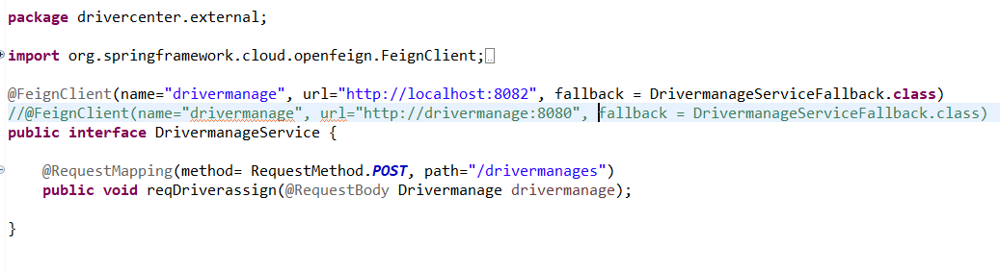


- drivercall에서 다음과 같이 전화번호가 있을 경우, drivermanage를 호출 하도록 합니다.
```
# Drivercall.java

  @PostPersist
    public void onPostPersist(){
    	System.out.println("휴대폰번호 " + getTel());
        System.out.println("호출위치 " + getLocation());
        System.out.println("호출상태 " + getStatus());
        System.out.println("예상요금 " + getCost());
        //Following code causes dependency to external APIs
        // it is NOT A GOOD PRACTICE. instead, Event-Policy mapping is recommended.   	
    	if(getTel() != null)
		{
    		System.out.println("SEND###############################" + getId());
			Drivermanage drivermanage = new Drivermanage();
			drivermanage.setId(getId());
			drivermanage.setOrderId(String.valueOf(getId()));
			drivermanage.setTel(getTel());
	        if(getLocation()!=null) 
	        	drivermanage.setLocation(getLocation());
	        if(getStatus()!=null) 
	        	drivermanage.setStatus(getStatus());
	        if(getCost()!=null) 
	        	drivermanage.setCost(getCost());
	        
	        // mappings goes here
	        DrivercallApplication.applicationContext.getBean(DrivermanageService.class)
	        	.reqDriverassign(drivermanage);
		}

    }
```

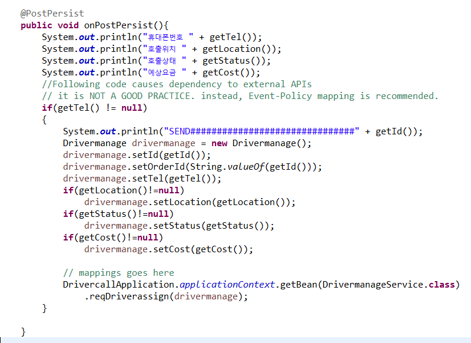

- 동기식 호출 적용으로 대리기사관리 시스템이 정상적이지 않으면 , 대리기사 호출도 접수될 수 없음을 확인합니다 
```
소스를 다음과 같이 바꾸고
@FeignClient(name="drivermanage", url="http://localhost:8082")//, fallback = DrivermanageServiceFallback.class)
public interface DrivermanageService {

    @RequestMapping(method= RequestMethod.POST, path="/drivermanages")
    public void reqDriverassign(@RequestBody Drivermanage drivermanage);

}

# 대리기사관리 시스템 down 후 대리기사를 호출하면, 대리기사호출 시스템에서 500 오류가 발생 합니다.

#drivercall

http http://localhost:8088/driverscalls/ tel="01012345678" location="마포아파트" status="호출" cost=30000
```

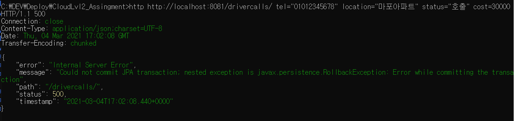

```
# 대리기사 관리시스템 (drivermanage) 재기동 후 호출을 진행 하면 정상동작합니다.

http http://localhost:8088/driverscalls/ tel="01012345678" location="마포아파트" status="호출" cost=30000
```


-서킷브레이크와 fallback 

다시 소스를 아래와 같이 바꾸고

```
@FeignClient(name="drivermanage", url="http://localhost:8082"), fallback = DrivermanageServiceFallback.class)
public interface DrivermanageService {

    @RequestMapping(method= RequestMethod.POST, path="/drivermanages")
    public void reqDriverassign(@RequestBody Drivermanage drivermanage);

}

대리기사관리 시스템 down 후 대리기사호출 시스템을 호출 하면 

#drivercall

http http://localhost:8088/driverscalls/ tel="01012345678" location="마포아파트" status="호출" cost=30000
```
서비스에서는 영향이 없으며, 다음과 같이 fallback 됩니다.

(대리기사 호출확정 되지 않음)

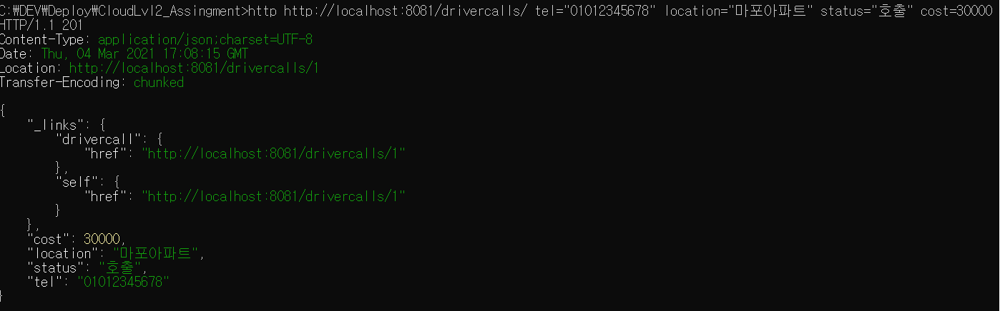

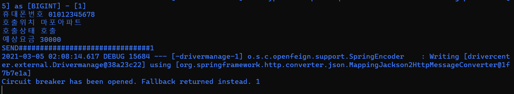


## 비동기식 호출 / 장애격리  / 성능

대리기사관리(drivermanage)와 대리기사 할당(driverassgine) 은 비동기식 처리이므로 , 대리기사 호출(drivercall) 의 서비스 호출에는 영향이 없다
대신, 대리기사 할당(driverassgine)이 정상적이지 않으면
대리기사 호출(drivercall) 후 상태가 [호출]->[호출중] 로 변경되고 할당이 완료되면 [호출확정] 로 변경이 되지만 , 
 대리기사 호출(drivercall)은 여전히 [호출중]로 남아있음. 
--> (시간적 디커플링)
<고객 대리기사호출 drivercall>
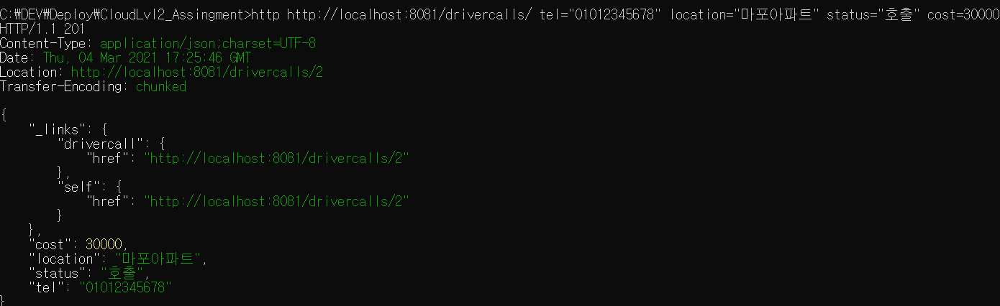

<택시 할당이 정상적이지 않아 호출중으로 남아있음>
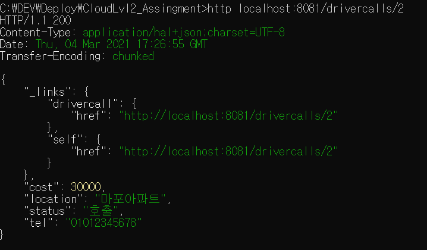


## 성능 조회 / View 조회
고객이 호출한 모든 정보는 조회가 가능하다. 

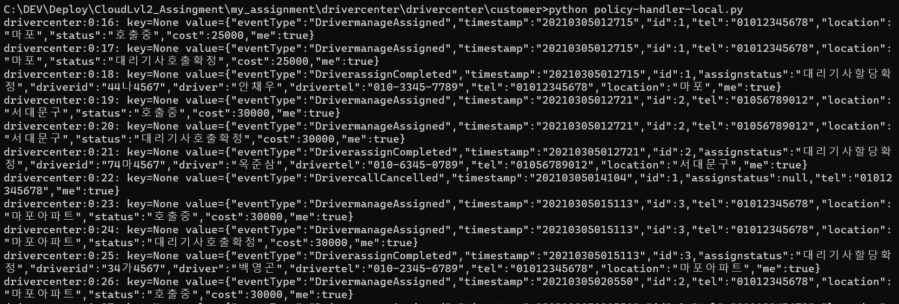


## MSA 서비스 빌드

<gateway>

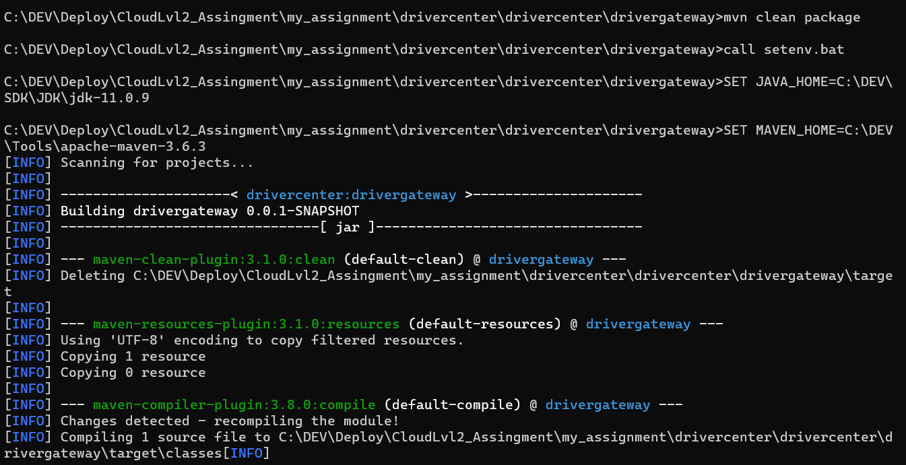
	
<drivercall>
	
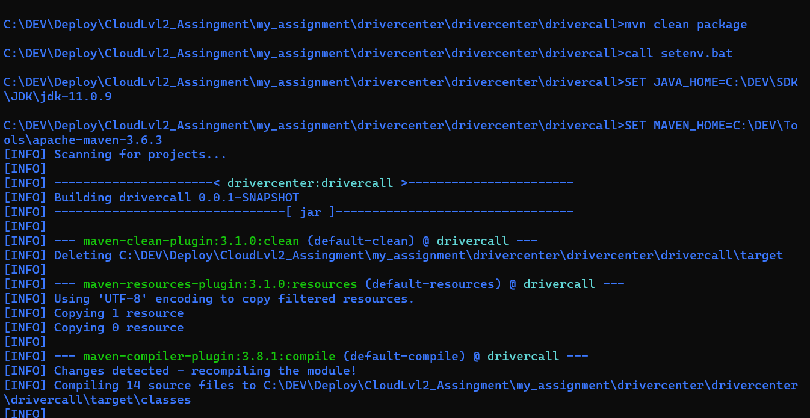

<drivermanage>
	
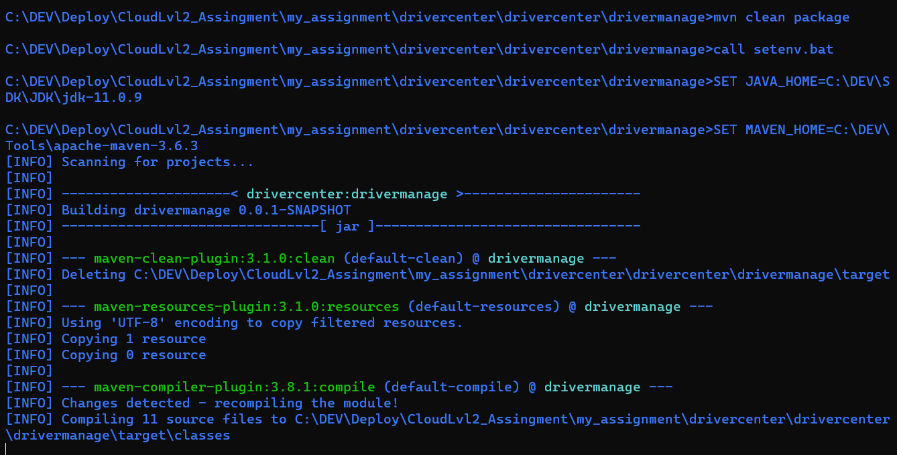

<driverassign>
	


# 운영

## 클라우드배포 / 운영파이프라인

- az login
```
{
    "cloudName": "AzureCloud",
    "homeTenantId": "6011e3f8-2818-42ea-9a63-66e6acc13e33",
    "id": "718b6bd0-fb75-4ec9-9f6e-08ae501f92ca",
    "isDefault": true,
    "managedByTenants": [],
    "name": "2",
    "state": "Enabled",
    "tenantId": "6011e3f8-2818-42ea-9a63-66e6acc13e33",
    "user": {
      "name": "skTeam03@gkn2021hotmail.onmicrosoft.com",
      "type": "user"
    }
  }
```


- 리소스그룹생성
```
그룹명 : skuser08-rsrcgrp
```


- 클러스터 생성
```
클러스터 명 : skuser08-aks
```

- 토큰 가져오기
```
az aks get-credentials --resource-group skuser08-rsrcgrp --name skuser08-aks
```

- aks에 acr 붙이기
```
az aks update -n skuser08-aks -g skuser08-rsrcgrp --attach-acr skuser08
```


- 네임스페이스 만들고 현재 컨텍스트에 붙이기
```
kubectl create namespace skuser08ns
kubectl config set-context skuser08-aks --namespace=skuser08ns
```

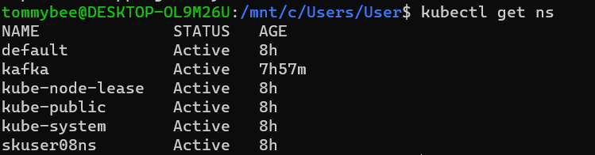

- 도커 이미지 만들어서 레지스트리에 등록하기 
```
cd customer
az acr build --registry skuser08 --image skuser08.azurecr.io/customer-policy-handler:v1 .

cd drivercall
az acr build --registry skuser08 --image skuser08.azurecr.io/drivercall:v1 .

az acr build --registry skuser08 --image skuser08.azurecr.io/drivercall:v2 .
cd ..

cd drivermanage
az acr build --registry skuser08 --image skuser08.azurecr.io/drivermanage:v1 .

cd ..
cd driverassign
az acr build --registry skuser08 --image skuser08.azurecr.io/driverassign:v1 .

cd ..
cd gateway
az acr build --registry skuser08 --image skuser08.azurecr.io/gateway:v1 .
```

- deployment.yml 도커이미지 이름으로 yml 파일 고치기

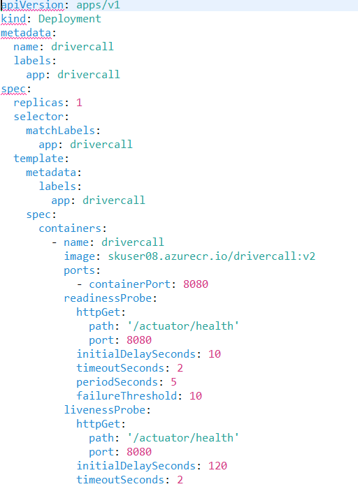

- deployment.yml/service.yaml을 사용하여 배포 


```
cd ../../
cd customer/kubernetes
kubectl apply -f deployment.yml --namespace=skuser08ns
kubectl apply -f service.yaml --namespace=skuser08ns
..이하 생략
```
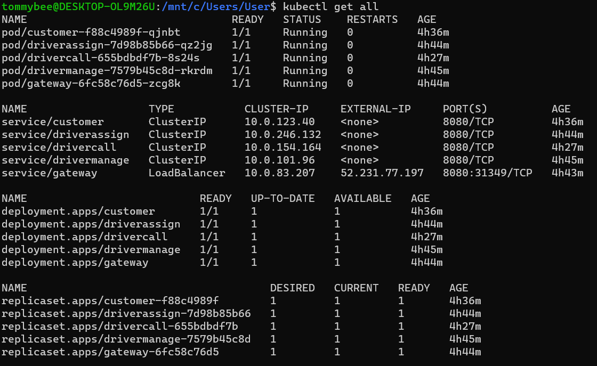


## 동기식 호출 / 서킷 브레이킹 / 장애격리

* 서킷 브레이킹 프레임워크의 선택: Spring FeignClient + Hystrix 옵션을 사용하여 구현함

시나리오는 -->결제(pay) 시의 연결을 RESTful Request/Response 로 연동하여 구현이 되어있고, 결제 요청이 과도할 경우 CB 를 통하여 장애격리.

- Hystrix 를 설정:  요청처리 쓰레드에서 처리시간이 610 밀리가 넘어서기 시작하여 어느정도 유지되면 CB 회로가 닫히도록 (요청을 빠르게 실패처리, 차단) 설정
```
# application.yml
feign:
  hystrix:
    enabled: true

# To set thread isolation to SEMAPHORE
#hystrix:
#  command:
#    default:
#      execution:
#        isolation:
#          strategy: SEMAPHORE

hystrix:
  command:
    # 전역설정
    default:
      execution.isolation.thread.timeoutInMilliseconds: 610

```


-----------------------------------------
* siege 툴 사용법:
```
 siege가 생성되어 있지 않으면 리소스 생성:
 kubectl run siege --image=apexacme/siege-nginx -n skuser08ns
 siege 내부로 들어가기:
 kubectl get pod #pod 확인
 kubectl exec -it pod/siege -c siege -n skuser08ns -- /bin/bash
 siege 종료:
 Ctrl + C -> exit
```
* 부하테스터 siege 툴을 통한 서킷 브레이커 동작 확인:
- 동시사용자 200명
- 60초 동안 실시

```
siege -c200 -t60S -r10 -v --content-type "application/json" 'http://drivercall:8080/drivercalls/ POST {"tel": "1234567890", "cost":3000}'
```
- 부하 발생하여 CB가 발동하여 요청 실패처리하였고, 밀린 부하가 대리기사호출 시스템에서 처리되면서 다시 호출을 받기 시작 

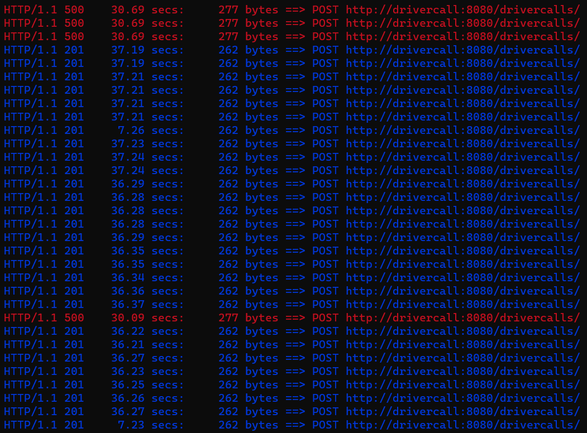

- report

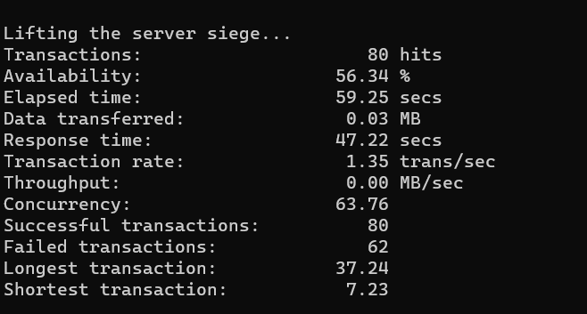

- CB 잘 적용됨을 확인


### 오토스케일 아웃

- 대리점 시스템에 대한 replica 를 동적으로 늘려주도록 HPA 를 설정한다. 설정은 CPU 사용량이 15프로를 넘어서면 replica 를 10개까지 늘려준다:

```
# autocale out 설정
store > deployment.yml 설정
```


```
kubectl autoscale deploy store --min=1 --max=10 --cpu-percent=15 -n phone82
```


-
- CB 에서 했던 방식대로 워크로드를 2분 동안 걸어준다.
```
kubectl exec -it pod/siege-5c7c46b788-4rn4r -c siege -n phone82 -- /bin/bash
siege -c100 -t120S -r10 -v --content-type "application/json" 'http://store:8080/storeManages POST {"orderId":"456", "process":"Payed"}'
```


- 오토스케일이 어떻게 되고 있는지 모니터링을 걸어둔다:
```
kubectl get deploy store -w -n phone82
```
- 어느정도 시간이 흐른 후 스케일 아웃이 벌어지는 것을 확인할 수 있다. max=10 
- 부하를 줄이니 늘어난 스케일이 점점 줄어들었다.


- 다시 부하를 주고 확인하니 Availability가 높아진 것을 확인 할 수 있었다.


## 무정지 재배포

* 먼저 무정지 재배포가 100% 되는 것인지 확인하기 위해서 Autoscale 이나 CB 설정을 제거함


- seige 로 배포작업 직전에 워크로드를 모니터링 함.
```
kubectl apply -f kubernetes/deployment_readiness.yml
```
- readiness 옵션이 없는 경우 배포 중 서비스 요청처리 실패


- deployment.yml에 readiness 옵션을 추가 


- readiness적용된 deployment.yml 적용

```
kubectl apply -f kubernetes/deployment.yml
```
- 새로운 버전의 이미지로 교체
```
cd acr
az acr build --registry admin02 --image admin02.azurecr.io/store:v4 .
kubectl set image deploy store store=admin02.azurecr.io/store:v4 -n phone82
```
- 기존 버전과 새 버전의 store pod 공존 중


- Availability: 100.00 % 확인


## Config Map

- apllication.yml 설정

* default쪽


* docker 쪽


- Deployment.yml 설정


- config map 생성 후 조회
```
kubectl create configmap apiurl --from-literal=url=http://pay:8080 --from-literal=fluentd-server-ip=10.xxx.xxx.xxx -n phone82
```


- 설정한 url로 주문 호출
```
http POST http://app:8080/orders item=dfdf1 qty=21
```


- configmap 삭제 후 app 서비스 재시작
```
kubectl delete configmap apiurl -n phone82
kubectl get pod/app-56f677d458-5gqf2 -n phone82 -o yaml | kubectl replace --force -f-
```


- configmap 삭제된 상태에서 주문 호출   
```
http POST http://app:8080/orders item=dfdf2 qty=22
```


## Self-healing (Liveness Probe)

- store 서비스 정상 확인


- deployment.yml 에 Liveness Probe 옵션 추가
```
cd ~/phone82/store/kubernetes
vi deployment.yml

(아래 설정 변경)
livenessProbe:
	tcpSocket:
	  port: 8081
	initialDelaySeconds: 5
	periodSeconds: 5
```


- store pod에 liveness가 적용된 부분 확인


- store 서비스의 liveness가 발동되어 13번 retry 시도 한 부분 확인


